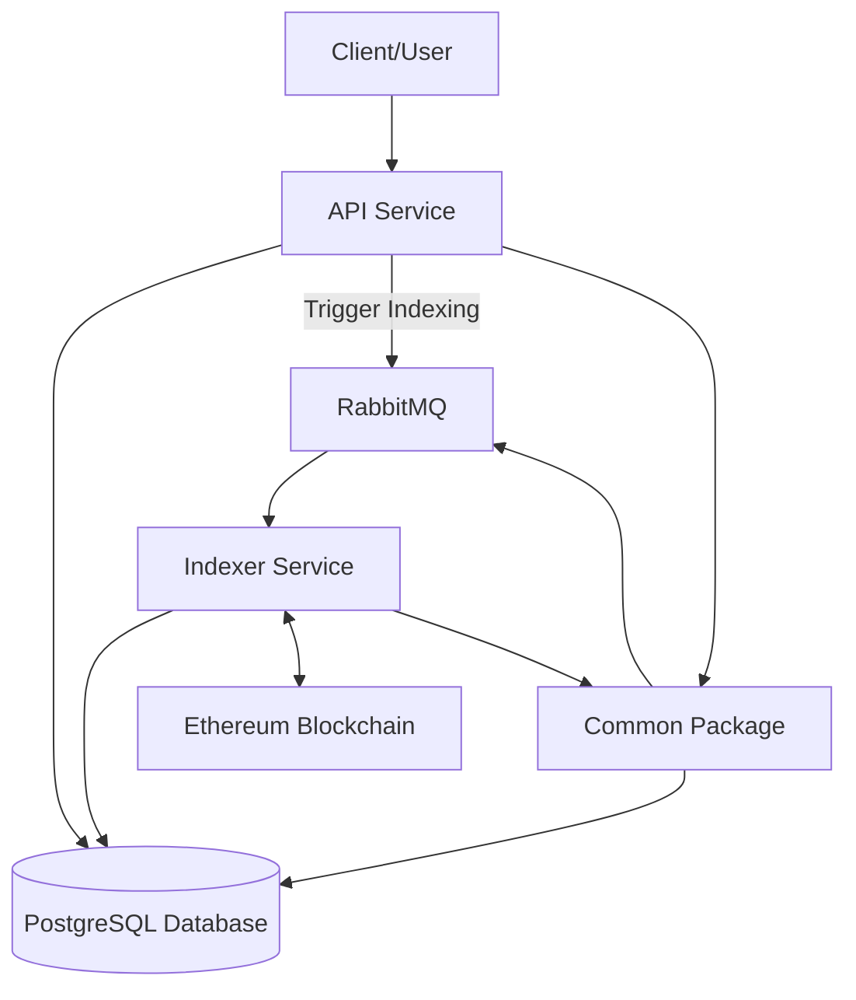
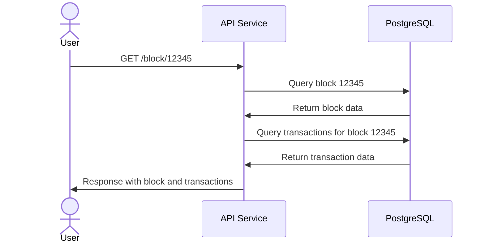
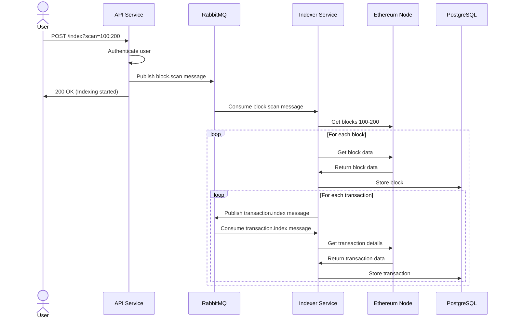
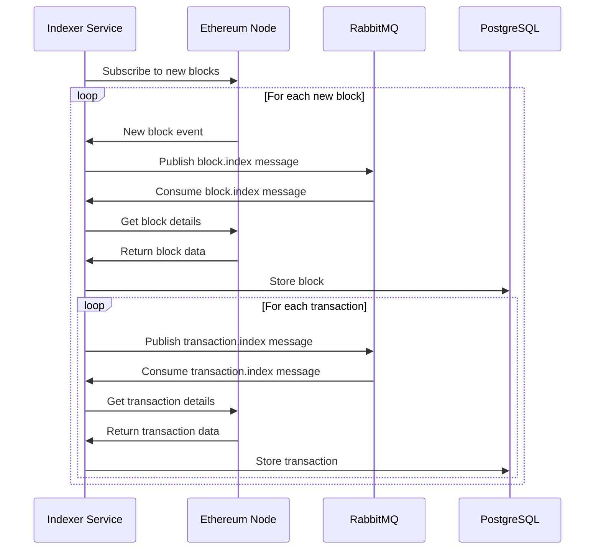

# Mini Blockchain Explorer: Architecture and Component Breakdown

The Mini Blockchain Explorer is a specialized application designed to scan, index, and provide access to blockchain data. Let me walk you through each component, how they interconnect, and the complete data flow of the system. with 2 microservice `api` and `indexer`.

## 1. API Service

The API service acts as the public interface of your blockchain explorer. It's built using Node.js with Express and TypeScript, providing REST endpoints that allow users to query blockchain data.

**Key responsibilities:**
- Handling HTTP requests from clients
- Retrieving data from the PostgreSQL database
- Formatting responses in a user-friendly way
- Triggering scan operations in the indexer service
- Protecting sensitive endpoints with JWT authentication

**Main REST API endpoints:**
- `/block` - Returns the latest block with its transactions
- `/block/:number` - Returns a specific block by number
- `/stats` - Returns overall blockchain statistics
- `/stats/:range` - Returns statistics for a specific block range
- `/stats/100:200` - return sum of all amounts and transactions between blocks 100 and 200
- `/tx` - Returns the latest transaction
- `/tx/:hash` - Returns a transaction by its hash
- `/index` - Triggers the indexer to scan blocks (requires authentication)
- `index/?auth_token&scan=100:200` - instructs our service to trigger indexer for a fresh scan of blocks between 100 and 200

**REST API with the following endpoints:**
- /block `[GET]`
- /stats `[GET]`
- /tx `[GET]`
- /index `[POST]`

The API service doesn't directly interact with the blockchain network; instead, it relies on the data indexed and stored in the database by the indexer service.

## 2. PostgreSQL Database

PostgreSQL serves as the persistent storage layer for blockchain data. It stores blocks and transactions that have been indexed by the system.

**Schema structure:**
- `blocks` table: Stores information about each block (number, hash, transaction count)
- `transactions` table: Stores transaction details (hash, from/to addresses, amount, nonce)

**PostgreSQL**
The database acts as a centralized repository that both the API and indexer services can access, eliminating the need to query the blockchain network for every user request.

Following it's just sample PostgreSql Tables Schema, we can elaborate based on the data we recieve from `Blockchain Provider`
**init.sql**
```sql
-- Create database if it doesn't exist
-- PostgreSQL automatically creates the database specified in POSTGRES_DB env var

-- Create extensions
CREATE EXTENSION IF NOT EXISTS "uuid-ossp";

-- Create tables
CREATE TABLE IF NOT EXISTS blocks (
    number INT PRIMARY KEY,
    hash VARCHAR(66) NOT NULL,
    tx_count INT NOT NULL,
    indexed_at TIMESTAMP NOT NULL DEFAULT CURRENT_TIMESTAMP
);

CREATE TABLE IF NOT EXISTS transactions (
    hash VARCHAR(66) PRIMARY KEY,
    block_number INT NOT NULL,
    "from" VARCHAR(42) NOT NULL,
    "to" VARCHAR(42) NOT NULL,
    amount NUMERIC(78, 0) NOT NULL,
    nonce INT NOT NULL,
    indexed_at TIMESTAMP NOT NULL DEFAULT CURRENT_TIMESTAMP
);

-- Create indexes
CREATE INDEX IF NOT EXISTS idx_transactions_block_number ON transactions (block_number);
CREATE INDEX IF NOT EXISTS idx_transactions_from ON transactions ("from");
CREATE INDEX IF NOT EXISTS idx_transactions_to ON transactions ("to");
```

## 3. Common Package

The common package contains shared code, utilities, configurations, and interfaces used by both the API and indexer services. This package helps maintain consistency and reduces code duplication across the microservices.

**Key components:**
- **Database entities and connection management:** Defines the data models and handles database connections
- **Blockchain provider:** Manages the connection to the Ethereum network
- **RabbitMQ connection utilities:** Provides functions for working with the message queue
- **Configuration management:** Loads environment variables and provides a consistent configuration interface
- **Shared types and interfaces:** Ensures type consistency across services

By centralizing these shared elements, the common package ensures that changes to core components like database models or configuration are automatically reflected in all services that depend on them.

## 4. Indexer Service

The indexer service is responsible for scanning the blockchain network, processing blocks and transactions, and storing them in the database for later retrieval.

**Key responsibilities:**
- Connecting to an Ethereum node to retrieve blockchain data
- Scanning specific block ranges when requested
- Subscribing to new blocks as they're created
- Processing transactions within blocks
- Storing blockchain data in the PostgreSQL database
- Using RabbitMQ for asynchronous processing
- The indexer should be able to scan the range if given from-to parameters, or simply subscribe to the latest blocks.
	Examples:
	- `Indexer 100 200` should scan all blocks from 100 to 200 (inclusive)
	- `Indexer 100` should scan all blocks starting from 100 to the latest, once reached the top it should subscribe to new incoming blocks
	- `Indexer` should scan for all blocks if they don't already exist in the database

The indexer can be triggered in several ways:
- Automatically on startup to scan a range of blocks
- Through the API's `/index` endpoint
- By subscribing to new block events from the blockchain


## 5. RabbitMQ

RabbitMQ is a message broker that enables asynchronous communication between components of the system. It manages message queues that decouple the process of requesting work from performing that work.

**Key functions in the system:**
- **Block processing queue:** Manages requests to process specific blocks
- **Transaction processing queue:** Handles requests to process transactions
- **Event distribution:** Allows multiple workers to process messages concurrently

**Benefits of using RabbitMQ:**
- Enables asynchronous, non-blocking operations
- Provides message persistence in case of service failures
- Allows load balancing of work across multiple instances
- Decouples components, making the system more maintainable and scalable

## 6. Blockchain Provider URL

The `BLOCKCHAIN_PROVIDER_URL` is a crucial configuration parameter that specifies the connection endpoint for an Ethereum node. This URL points to an Ethereum JSON-RPC API that gives access to blockchain data.

**Why it's needed:**
- Provides the entry point for all blockchain data retrieval
- Allows the indexer to scan blocks and transactions
- Enables subscribing to new block events

**Options for the provider:**
- **Public nodes:** (https://ethereum-rpc.publicnode.com/)

Without a valid blockchain provider URL, the indexer cannot access blockchain data, making it impossible to populate the database with blocks and transactions.

## Data Flow and Architecture

Now let's visualize how these components work together:

### System Architecture Diagram



### Sequence Diagram: User Requesting Block Data



### Sequence Diagram: Indexing New Blocks



### Sequence Diagram: Real-time Block Subscription



## Complete Data Journey

Let me walk you through the complete journey of blockchain data in this system:

1. **Data Ingestion:**
   - The indexer service connects to an Ethereum node via the blockchain provider URL
   - It either scans specific block ranges or subscribes to new block events
   - For each block, it retrieves the block header and list of transactions

2. **Data Processing:**
   - The indexer extracts relevant information from blocks (number, hash, transaction count)
   - For each transaction, it extracts details (from/to addresses, amount, nonce)
   - This data is stored in the PostgreSQL database

3. **Data Access:**
   - Users make requests to the API service via HTTP
   - The API queries the database to retrieve the requested information
   - Data is formatted as JSON and returned to the user

4. **Asynchronous Operations:**
   - RabbitMQ manages queues of work items (blocks and transactions to process)
   - The indexer consumes these messages and processes them asynchronously
   - This allows the system to handle large volumes of data without blocking

5. **Real-time Updates:**
   - The indexer subscribes to new block events from the Ethereum network
   - As new blocks are created, they're automatically processed and stored
   - This keeps the explorer data fresh and up-to-date
